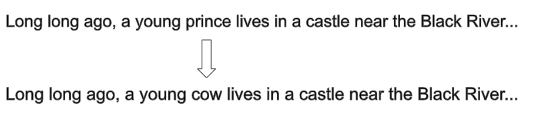
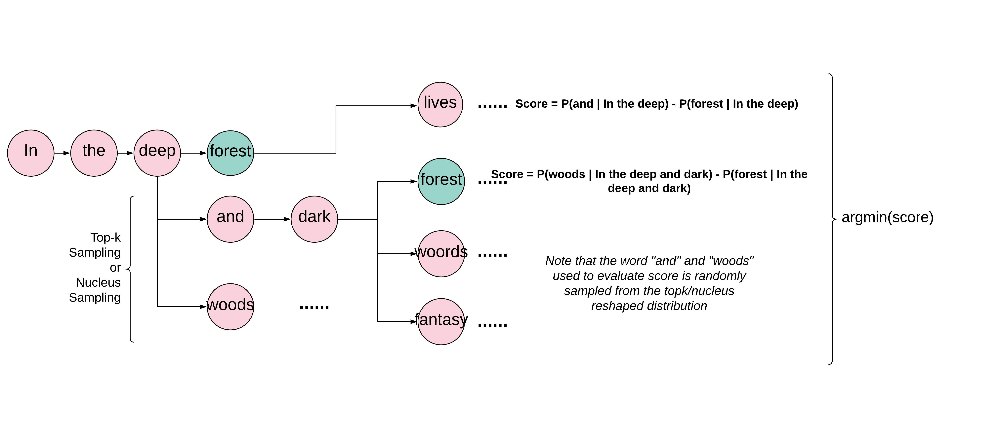
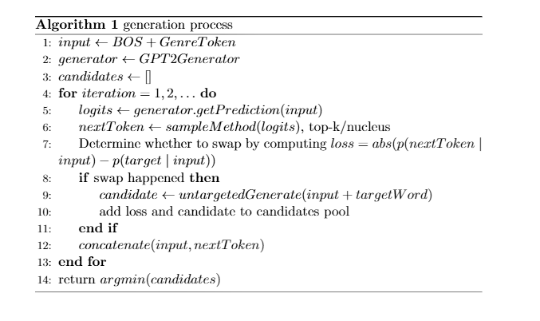
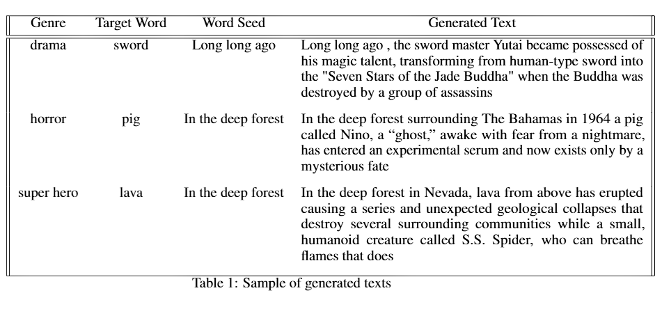
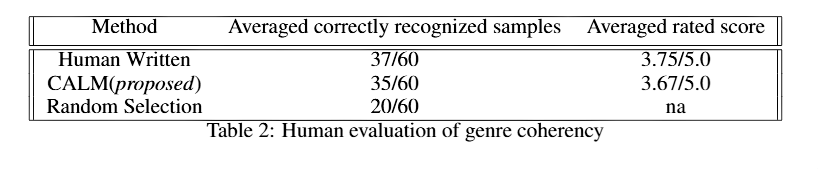
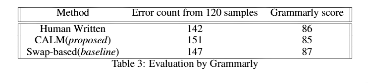
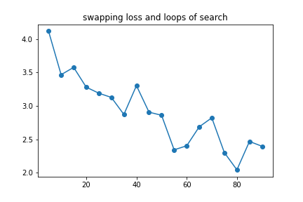

## Video

<iframe width="1008" height="567" src="https://www.youtube.com/embed/WQxsgLZk0yg" frameborder="0" allow="accelerometer; autoplay; clipboard-write; encrypted-media; gyroscope; picture-in-picture" allowfullscreen></iframe>

## Project Summary

We propose Context Aware Language Generator for Minecraft(CALM), a framework for generating environment aware, style specific text snippets in Minecraft. Specifically, our agent will recognize the surrounding environment, which we refer to as context, to generate short stories that are coherent to the received environment. For example, given a river flowing near the agent as context and a user defined style such as horror story style, the agent should be able to generate short text snippets that contain string “river” in the style of horror stories. Concretely, we decided that our system will support generation of the following six styles: superhero, action, drama, horror, thriller, and sci_fi. Meanwhile, our system could take into account discrete blocks, composite blocks, weather and time of day when generating text snippets.

To be able to generate diverse and realistic stories, we believe it is important to incorporate AI/ML algorithms in the generation process. Existing works on generating text with given string usually involves training customized model or changing the generation process to deviate from auto-regressive manner, thus making it not convenient to leverage these methods(7,10,13). On the other hand, modification-based methods that swapps the words into templates/existing texts fails to generate diverse samples, and the generated texts depends on its template(8).  With these issues in mind, we propose to make use of pre-trained style-aware language model with our modified search-based decoding algorithm that ensures the output text contains the target string. We show our method could generate results that are style-coherent and sntactically-sound when compared to human-written texts, and does not require the user to train a customized model.

 

## Approaches

To achieve our goal of generating text that is coherent to the environment in Minecraft, our work involves the following two modules:

* A environment-perception module that returns string of nearby objects based on nearby blocks, mobs, and configurations in Malmo world XML file.

* A text generation module that generates a story snippet based on given strings produced by the environment-perception module. 

The rest of this section is organized as follows: we first cover the <b>background concepts related to our implementation</b>, then introduces both the <b>baseline and proposed version of language generation approach</b>. Finally, we introduce how we <b>retrieve string from the Malmo environment</b>.

### 1. Background

To make the report self-contained, we briefly cover the concept of language modeling, text generation, decoding methods, part-of-speech tagging and GPT-2 in this subsection. 

* <i>Language modeling: </i> The objective of language modeling is to learn the probability of a given sentence s and its words $$w_i$$, denoted as $$s=(w_0,w_1,...w_n)$$ with respect to some corpus. When using a neural network with set of parameters $$\theta$$ to conduct language modeling, the task is often formulated as a classifier that attempts to learn the true probability distribution of the next token given a series of previous words $$p_{\theta}(w_i \mid w_{<i}) \approx q(w_i \mid w_{<i})$$.

* <i>Text generation and decoding methods: </i> Losely speaking, text generation is achieved by incrementally generating the next word $$w_i$$ given $$w_{<i}$$, until an end of sentence token is sampled($$w_i = \textit{<EOS>}$$). However, various research have shown that greedy decoding algorithm that selects word that maximizes the conditional probability $$p(w_i \mid w_{<i})$$ is problematic, and imposes issues such as generated text becomes a sequence of same words.

    To address this issue, several methods such as beam search, top-k sampling and nucleus sampling have been developed, with the general idea of incorporating stochasticity into the generation process(5, 11). Generally, these algorithms will still choose a word $$w_i$$ with high probability at each step, but do not always choose the word that maximizes the conditional probability.
    
    
* <i>Part of speech tagging:</i> Part of speech tagging is the task of assigning part of speech to each word for a given sequence. Examples of POS tags are Nouns(NN), proper Nouns(NNP) and coordinating conjunctions(CC). There are multiple ways to achieve this task, such as neural network based methods and conditional random field based methods. Libraries that provides this functionality includes NLTK, StanfordNLP tagger, etc(9, 12).

* <i>GPT-2: </i>The GPT-2 model is a [transformer](http://jalammar.github.io/illustrated-transformer/)-based model trained on 8-million web pages(1, 4). The model could be used as-is, but could also be fine-tuned on domain specific text to adapt to tasks that require the model to understand things beyond web pages. For example, our work uses a GPT-2 model fine-tuned trained on story pieces that begins with a special genre token, and thus the genre of generated text could be controlled by conditioning the decoder on any genre token of choice(4).

### 2. Text generation methods

We introduce the implementaion of our baseline and proposed approach, and discuss their advantages and disadvantages in this subsection.

#### 2.1 baseline generation approach

{:height="65%" width="65%"}

In comparison to our proposed generation method, we implemented a generator that swaps the target string into pre-stored human-written story snippets. Upon initialization, the generator keeps a publically available pool of stories with genre labels, originally used to train neural models(4). In the generation process, we first randomly sample a story snippet of desired genre from the story pool, then swaps the given string into the sampled story. 

To determine the position to swap the target string in, we make use of [part-of-speech](https://medium.com/analytics-vidhya/pos-tagging-using-conditional-random-fields-92077e5eaa31#:~:text=POS%20tagging%20is%20the%20process,which%20the%20word%20is%20used.) labels. Specifically, we view a position in the sampled text as potential position if the part-of-speech tag of the original token at such position is the same as the desired string. For example, the swap in the above picture happened because 'pince' and 'cow' are both Nouns.

#### 2.2 proposed generation approach

{:height="80%" width="80%"}

<i>our proposed approach</i>

We choose pretrained GPT-2 model fine tuned on style specific corpus such as horror story and super hero stories for language generation(4, 6). During the training process, the pre-trained model was given samples that starts with a genre token, thus the model will learn to generate different texts based on the given genre token. A typical sample in training data looks like the following:

* \<horror\>\<BOS\>...a short horror story...

Thus, we would be able to control the generation behaviour of the model by conditioning the model on the same special style tokens. At each language generation step, the pretrained model ouputs a logits of  corpus size that specifies the probability of the corresponding words to appear at the current position. Traditionally, the word chosen at each generation step is achived by approaches such as nucleus sampling and top-k sampling(14). 

To achieve context aware langauge generation, our system retrieves description of surrounding blocks from adjacent blocks of the agent(such as 'diamond_block') and returns a string that is common in natural language('diamond'). We then try to make the target word appear in our output text snippet by finding a position where the target word is most likely to appear. Formally, the context aware language generation task is defined as finding a sequence $$(w_1,w_2,w_3... w_n)$$ with an victim word $$w_v$$ such that $$abs(p(target word \mid w_0, ... , w_{v-1})-p(w_v \mid w_0, ... , w_{v_1}))$$ is minimized, while the raw probability of a certain word is sampled at each generation step after the word swapping happened is given by $$p(w_i \mid w_0, w_1, ... , target word, ... , w_{i-1})$$(prior to applying topk/nucleus sampling). 

<i>a more detailed description</i>

To find the optimal sequence, our system generates candidate sequence by computing the potential target word swapping loss $$abs(p(target word \mid h_{t-1})-p(chosen word \mid h_{t-1}))$$ at each generation step t, and view the current sequence as a candidate hypothesis if such loss is smaller than a pre-defined threshhold. Upon generation of a hypothesis, the word swapping loss is assigned to that branch as a score. Meanwhile, the system will keep on the generation process with other possible cases where the word swap did not take place, untill a new position where the target word could be swapped in or end of generation steps is reached. After the exploration of candicate hypothesises is done, we choose the word sequence with lowest swapping loss as output.

#### 2.3 discussion of generation approaches

The baseline method had the advantage of being easy to implement and having fast inference time. However, the swap-based nature makes it unable to generate completely orginal text snippets. Meanwhile, while POS tagger most gerentees the generated text is grammartically correct, this approach does not take into consideration the meaning of the target word. Compared to the baseline, our proposed method could generate more diverse and unseen text snippets. Meanwhile, the model could consider the semantics of the target words in generation process, thus could produce more natural texts with given string. Howver, due to the large search space that is explored in the decoding process, our proposed method have longer inference time when compared to the baseline model.

### 3. The environment perception module

#### 3.1 Environment perception methods

We cover our methods for retrieving strings from surrounding environment in this section. 

* <i>Detecting object from single block:</i> 

    We use ObservationFromGrid to detect the object from a single block. When present, the Mod will return observations that say what the nearby blocks are.

* <i>Detecting object from composite block:</i> 

    We use ObservationFromGrid to detect the object from a single block. When present, the Mod will return observations that say what the nearby blocks are and I use some if and else to determine the composite block. For example, if there are two or more leaves, it must be a tree.

* <i>Detecting mob:</i> 

    We use ObservationFromNearbyEntities to detect mobs. When present, the Mod will return observations that list the positions of all entities that fall within the given ranges of the agent. A JSON array will be returned for each range requested, named using the name attribute of the range. Within the array will be a series of elements, one for each entity
    
* <i>Detecting weather:</i> 

    The Malmo API does not provide support for the agent to percept the weather, but a user might want to modify the time of day using Malmo environment xml. In that case, we provide ability in our system to return a string that corresponds to the current weather in game(rain, thunder, clear). 
    
* <i>Detecting time of day:</i> 

    The Malmo API does not provide support for the agent to percept the in-game time of day, but a user might want to modify this environment feature using Malmo environment xml. We also provide ability in our system to return defined time of day(day/night) string.
    
#### 3.2 Interaction between environment perception and text generation modules

We designed the two modules to be stand alone, and both could be used as-is. We include relevant implementaion that is required to replicate our results in the demo video in this section, but both modules should be easily customizable.

## Evaluation

To evaluate our proposed generation method, we compare results of our method against our baseline and/or human written short story snippets in various setups. We evaluate our results by the following characteristics:

* <i>Style coherency:</i> We expect our generated text to be coherent with the intended style, ideally as coherent as human-written texts. 

* <i>Syntactical soundess:</i> We expect our generated text is grammartically correct. 

* <i>How well does target strings blend in:</i> We expect the target string to fit smoothly into the generated text.

For all samples from our proposed method, we used top-k sampling option and constraint that the model returns the best searched solution in 30 words. We show our method could generate text that is generally on par with human written story snippets in terms of style and grammar. 

### 1. Style coherency

To ensure the results we generated are style coherent, we choose to use human evaluation metrics to ensure the ouputs are indeed of the intended style. We use two methods to check this feature: letting human evaluators guess the style of a given text without knowing its genre, and letting human evaluators rate the style coherency of a text given its genre. In both settings, we evaluated our generated text against human written text snippets. Note that our swap-based generator uses samples from the same human written text dataset, thus we omit its results from this section in particular.

#### 1.1 Measurement by style classification

Specifically, we randomly sample sentences with different styles from our system, and let human readers guess the genre of the generated sentence. Upon evaluation, the human rater is allowed to pick two genres out of the six possible genres. We mark a text snippet is correctly recognized if one of the guessed genre by human evaluator is the true genre of that text. We report the averaged recognized examples among human evaluators as follows:

    
Note that the Random Selection row is the result one would get if genre labels were randomly assigned to 60 samples with balancely distributed genres. Interestingly, upon evaluation we found that it is harder than expected for a human evaluator to guess the genre of a text snippets. In conclusion, we show that our  generated result could achieve similar performance as human-produced texts.

#### 1.1 Measurement by score-based evaluation

We then let human evaluators rate the coherence score of a piece of text given its genre from 0 to 5. More precisely, 0 means not coherent at all and 5 means the genre is extremely clear. We show that our generated text generally achieves result as good as human written texts.

### 2. Syntactical soundness

To ensure our method only impose minimal damage to the ability of language model to generate syntactically correct text, we use Grammarly, an open source grammar checker to check the suspected grammar errors in our generated text. For a given docment, grammarly will reports the count of suspected errors and an overall score for writting([description of grammarly score](https://support.grammarly.com/hc/en-us/articles/360007144751-What-is-Performance-and-how-is-it-calculated-)).

Specifically, we pasted 120 generated samples for both the proposed method, the baseline method and human written texts into grammarly. The number of flagged errors and overall writing scores is shown as above. We conclude that our proposed method could generate text that are as grammarly sound as humans.

In general, all methods of generation will generate grammartically correct text snippets, and the difference in error count and scores is within the tolerant level for compensating the stochasity of sampling. Note that grammarly assigns different weights for different errors, so a document with more errors could still get a higher overall score - the Grammarly Score should be treated more of a qualititive metric.

### 3. How well does target string blend in?

Since both our basedline and proposed approach works by replacing a victim word by the target word at some porint in the generation process, a natural question to ask is how naturally does the target string fit into the produced text. As naturalness is generally a subjective term, we use human ratings for this metric and treat this as a qualitative feature. Conceretly, we sample sentences pairs containing the same string from both generators 60 times to construct evaluation dataset for this subsection. We then let a human evaluator pick the sentence in which the target string looks more natural without knowling the producer of each samples.

Out of 60 samples, our proposed method outperforms the basedline method in 52 cases. Interestingly, some of the text generated by swap-base generator is clearly problematic, but will look banal to grammar check such as Grammarly. For example, our baseline method will generate the followin text:

* The film is set in a diamond setting...

It is clear that diamond is a inserted word, and the grammar is also not completely coherent here. However, both Grammarly and GoogleDoc grammar checker fails to recognize such incongruity. Compared to the baseline, our model could put the target word into context. For example:

* ...to study the ancient history of pig farming...

When recognized that pig is inserted in the generation process, out model will went on to talk about related terms like "farming", thus the generated text looks more natural. In summary, we show that our model uses target strings better than the baseline model.

### 4. Appendix - Other discussions related to evaluation

#### 4.1 Ability for our system to swap at least one target word

A basic requirement for our language generation task is the ability to make the target string appear in the output. To evaluate this, we queried both our baseline generator and proposed generator for 120 samples, and both of the generators succeeded in all cases. 

#### 4.2 Target swapping loss and quality trade-off

A natural question that comes with our generation task is whether there is a limit with respect to how many target strings we could make the output contain. As our system keeps track of all possible choices of outputs, the answer to such question will depend on how much quality of the generated text is the user willing to compensate, and whether there is any length constraint of the output.

As a general suggestion, we show the target swapping loss(defined in Approach-2.2) for the model's best result with respect to the length constraint of output text(for each target word). Naturally, the longer the output can be, the better the quality of swapping will be. For example, if the user accepts the quality of a search loop of 5, and want to make 5 words appear in the output, the model should be able to find the solution in 25 words, excluding remaining words that the model need to sample before the EOS token.

We already demonstrated the quality of text generated by 30 search loops in previous evaluation experiments in this section. We now provide some additional examples here for a taste of the quality of generated text at different swap loss levels. 

* Long long ago, an elite \[\[\[diamond\]\]\] collection is being assembled at the vast Smithfield diamond museum. (6.071291923522949)

* Long long ago in a Southern California \[\[\[forest\]\]\] bayou, 21-year-old Eddie Brock (Joseph Bottoms) is swimming alone when Jack (Perry Henry) walks by.(1.9446792602539062)
* Long long ago, the \[\[\[forest\]\]\] was full of what used to be golden deer corpses and deformed people...(0.38306617736816406)

## References

1. [Attention Is All You Need](https://arxiv.org/abs/1706.03762)

2. [Better Language Models and Their Implications](https://openai.com/blog/better-language-models/)

3. [Grammarly](https://twitter.com/Grammarly?ref_src=twsrc%5Egoogle%7Ctwcamp%5Eserp%7Ctwgr%5Eauthor)

4. [GPT2 Genre Based Story Generator](https://huggingface.co/pranavpsv/gpt2-genre-story-generator)

5. [Hierarchical Neural Story Generation #aka topk samping](https://arxiv.org/pdf/1805.04833.pdf) 

6. [Huggingface: On a mission to solve NLP, one commit at a time.](https://huggingface.co/)

7. [Insertion Transformer: Flexible Sequence Generation via Insertion Operations](https://arxiv.org/abs/1902.03249)

8. [Masterpiece Generator](https://www.plot-generator.org.uk/story/)

9. [Natural Language Toolkit](https://www.nltk.org/)

10. [Progressive Generation of Long Texts](https://arxiv.org/abs/2006.15720)

11. [The Curious Case of Neural Text Degeneration](https://arxiv.org/abs/1904.09751)

12. [The Stanford CoreNLP Toolkit](https://stanfordnlp.github.io/CoreNLP/)

13. [Topic Aware Neural Response Generation](https://arxiv.org/abs/1606.08340)

14. [Neural Language Generation: Formulation, Methods, and Evaluation](https://arxiv.org/abs/2007.15780)
