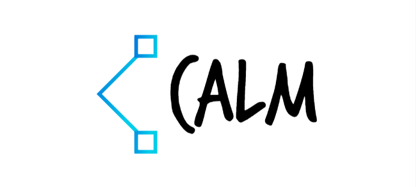
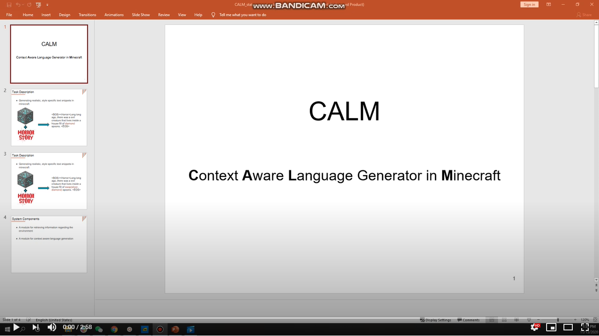

## Context Aware Language generator for Minecraft

Tell a story about surrounding environment in Minecraft with [SOTA language generators](https://huggingface.co/)!

{:height="80%" width="80%"}

## Explore the best output by search-based decoding

Our decoding algorithm finds the optimal position for generating target word forest by keeping track of each "universe" it experienced.

{:height="80%" width="80%"}

#### Check out our reports and code repo

Source code: https://github.com/bihaox/CALM 

- [Proposal](proposal.html)
- [Status](status.html)
- [Final](final.html)

